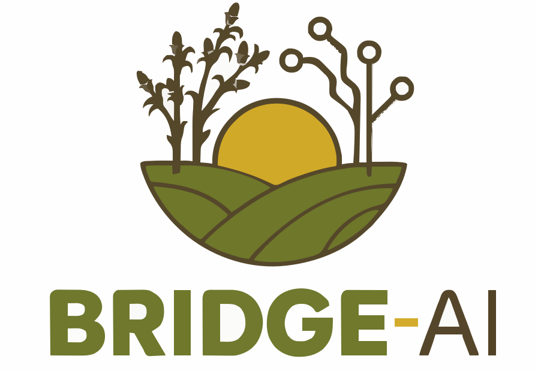

# BRIDGE-AI Kenya Website

<div align="center">



**Building ResIlient Development with GEnerative AI in Education & Agriculture**

[](https://www.python.org/)
[](https://flask.palletsprojects.com/)
[](LICENSE)

</div>

---

## 📋 Table of Contents

- [Overview](#-overview)
- [Project Objectives](#-project-objectives)
- [Technology Stack](#-technology-stack)
- [Project Structure](#-project-structure)
- [Installation](#-installation)
- [Configuration](#-configuration)
- [Running the Application](#-running-the-application)
- [Content Management](#-content-management)
- [Admin Panel](#-admin-panel)
- [Deployment](#-deployment)
- [Contributing](#-contributing)
- [License](#-license)

---

## 📖 Overview

BRIDGE-AI Kenya is the local web presence for JKUAT's contribution to the Horizon Europe BRIDGE-AI project. The website documents the Smart Mushroom pilot, Kenya Living Lab, WP5 capacity-building activities, and serves as a living activity archive and reporting-support platform.

**Built with JSON storage** - No database required! All content is stored in simple JSON files, making it lightweight, portable, and easy to manage.

### Key Features

- ✅ **Public Visibility** - Showcase JKUAT's BRIDGE-AI work to farmers, students, SMEs, partners, and policymakers
- ✅ **Activity Documentation** - Publish local updates, pilot progress, training events, and media outputs
- ✅ **Capacity Building** - Support WP5 bootcamps, training resources, and SME mentoring
- ✅ **Smart Mushroom Storytelling** - Explain GenAI, IoT sensors, digital shadows, and low-bandwidth dashboards
- ✅ **Reporting Evidence** - Archive evidence for dissemination KPIs and EU visibility compliance
- ✅ **Replication** - Show how the Kenya pilot supports youth and women-led farms
- ✅ **JSON Storage** - No database setup required - all content in human-readable JSON files

### Project Information

| Field | Value |
|-------|-------|
| **Project** | BRIDGE-AI (Building ResIlient Development with GEnerative AI in Education & Agriculture) |
| **Grant Agreement** | No. 101299050 |
| **Programme** | Horizon Europe Research and Innovation Action |
| **Granting Authority** | European Health and Digital Executive Agency (HADEA) |
| **Duration** | 36 months |
| **Countries** | Kenya, Tunisia, Nigeria |
| **Coordinator** | FUNDACIO EURECAT (EURECAT), Spain |
| **JKUAT Role** | Beneficiary, Smart Mushroom case-study host, WP5 Capacity Building and Replication lead |
| **Kenya Site** | Mushroom Demonstration Farm, JKUAT Smart Farm Zone, Juja, Kenya |

---

## 🎯 Project Objectives

| Objective | Description |
|-----------|-------------|
| **Public Visibility** | Make JKUAT's BRIDGE-AI work visible to all stakeholders |
| **Activity Documentation** | Publish local updates, pilot progress, and media outputs |
| **Capacity Building** | Support WP5 bootcamps, training resources, and SME mentoring |
| **Smart Mushroom Storytelling** | Explain GenAI, IoT, and digital shadow applications in Kenya |
| **Reporting Evidence** | Archive evidence for dissemination KPIs and EU compliance |
| **Replication** | Show how the Kenya pilot supports youth and women-led farms |

---

## 🛠 Technology Stack

| Component | Technology |
|-----------|------------|
| **Web Framework** | Flask 2.3.3 |
| **Data Storage** | JSON Files (No Database!) |
| **Forms** | WTForms 3.0.1 |
| **Authentication** | Flask-Login 0.6.2 |
| **File Uploads** | Flask-Uploads 0.2.1 |
| **Image Processing** | Pillow 10.0.0+ |
| **Email** | Flask-Mail 0.9.1 |
| **Production Server** | Gunicorn 21.2.0 |
| **Containerization** | Docker & Docker Compose |
| **Web Server** | Nginx |

---

## 📁 Project Structure
bridge_ai_kenya/
│
├── app/
│ ├── init.py # App factory
│ ├── config.py # Configuration classes
│ ├── extensions.py # Flask extensions
│ ├── routes.py # All routes
│ │
│ ├── data/ # JSON DATA STORAGE
│ │ ├── activities.json # News and updates
│ │ ├── events.json # Training events
│ │ ├── resources.json # Public resources
│ │ ├── partners.json # Consortium partners
│ │ ├── team.json # JKUAT team members
│ │ ├── faqs.json # Frequently asked questions
│ │ ├── gallery.json # Photo albums
│ │ ├── settings.json # Site settings & counters
│ │ ├── submissions.json # Form submissions
│ │ └── users.json # Admin users
│ │
│ ├── services/ # JSON CRUD service
│ │ ├── init.py
│ │ └── json_service.py
│ │
│ ├── templates/
│ │ ├── header.html # Navigation with dropdowns
│ │ ├── footer.html # Footer with EU funding
│ │ ├── index.html # Homepage
│ │ ├── about.html # About page
│ │ ├── jkuat_role.html # JKUAT role page
│ │ ├── smart_mushrooms.html # Smart Mushrooms page
│ │ ├── activities.html # Activities (dynamic)
│ │ ├── training_wp5.html # Training & WP5 (dynamic)
│ │ ├── resources.html # Resources (dynamic)
│ │ ├── partners.html # Partners (dynamic)
│ │ ├── gallery.html # Gallery (dynamic)
│ │ ├── contact.html # Contact page
│ │ ├── privacy_ethics.html # Privacy & Ethics page
│ │ │
│ │ └── admin/
│ │ ├── login.html # Admin login
│ │ ├── dashboard.html # Admin dashboard
│ │ └── manage.html # All CRUD operations (single page)
│ │
│ └── static/
│ └── images/
│ ├── hero/ # Hero slider images
│ ├── logos/ # Project logos
│ ├── uploads/ # User-uploaded files
│ └── gallery/ # Gallery photos
│
├── .env # Environment variables
├── .env.example # Example env file
├── .gitignore
├── requirements.txt # Production dependencies
├── requirements-dev.txt # Development dependencies
├── run.py # Development server
├── wsgi.py # Production WSGI
├── gunicorn.conf.py # Gunicorn config
├── Dockerfile # Docker build
├── docker-compose.yml # Dev Docker Compose
├── docker-compose.prod.yml # Production Docker Compose
├── entrypoint.sh # Docker entrypoint
├── nginx.conf # Nginx config
├── README.md
└── LICENSE


---

## 🚀 Installation

### Prerequisites

- Python 3.11+
- Docker & Docker Compose (optional, for containerized deployment)

### Local Development Setup

```bash
# 1. Clone the repository
git clone https://github.com/yourusername/bridge_ai_kenya.git
cd bridge_ai_kenya

# 2. Create virtual environment
python -m venv venv
source venv/bin/activate  # On Windows: venv\Scripts\activate

# 3. Install dependencies
pip install -r requirements.txt

# 4. Install development dependencies (optional)
pip install -r requirements-dev.txt

# 5. Copy environment variables
cp .env.example .env

# 6. Edit .env with your configuration
nano .env

# 7. Seed initial data
flask seed

# 8. Run the application
python run.py